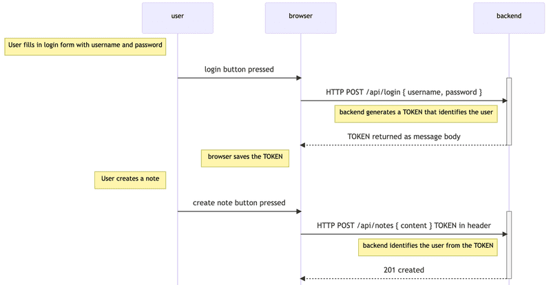

# A - Structure of Backend Application, Introduction to Testing
## Project Structure
By simplifying the index.js file through the usage of modules (node.js best practices), we allow for faster testing by making HTTP API calls rather than HTTP over the network.

A module dedicated to storing route handlers are called controllers, the only change is that at the top of the routes, we declare a new router object:
`const personsRouter = require('express').Router()` and export it with `module.exports = personsRouter`. We can also shorten the routes from `/api/persons/:id` to `/:id` in the controller and declare a relative route in the app.js file: `app.use('/api/persons', personsRouter)`

A router object is an isolated instance of middleware and routes -- a mini-application, capable of only performing middleware and routing functions.

Moreover, we can store files that handle middleware or logging commands to the console within a utils folder. 

## Testing Node Applications (JEST)
Jest is a testing library/test runner for JavaScript created by Facebook and is a dev dependency.

### Install
`npm install --save-dev jest`
### Scripts
`"test": "jest --verbose"`
### Configs
#### package.json
```
"jest": {
    "testEnvironment": "node"
}
```
#### .eslintrc.js
```
module.exports = {
    'env': {
        'jest': true
    }
}
```

We can define the functions we use for testing in the utils folder: utils/for_testing.js

In a separate folder named tests, we can define the test functions: tests/name.tests.js (.tests.js is required). In this file we can define tests. Furthermore, we can add tests within a describe block which allows us to group our tests in a category, making it clear in the console.

```
describe('test category name', () => {
    test('test name', () => {
        const a = []
        const result = testFunction(a)

        expect(result).toBe(0)
    })

    // other tests
})
```

## Lodash
Lodash is a JavaScript utility library that provides functions for common programming tasks related to working with arrays, objects, strings and functions. This allows for simplifying complex operations

# B - Testing Backend
## Test Environment
The convention in Node is to define the execution mode of the application with NODE_ENV in our scripts: `"dev": NODE_ENV=test jest --verbose --runInBand`

Therefore, when launching a test we can use a different database:
`const MONGODB_URI = process.env.NODE_ENV === 'test ? process.env.TEST_MONGODB_URI : process.env.MONGODB_URI`

## Supertest
Supertest is a library for testing HTTP assertions and often used in combination with Jest. In other words, we can create HTTP requests to our server and make assertions about the responses.
```
const supertest = require('supertest');
const app = require('../app'); // Replace with the path to your Express app

const api = supertest(app); // Use api.<method> to make a request
```
The test imports the Express application from the app.js module and wraps it with the supertest function into a so called superagent object. This provides us with HTTP methods to create requests to different endpoints (the last line)

## Run Tests Individually
It is important to run tests individually for several reasons, one being that each test is isolated and independent of each other, not relying on the state left by another test. To run tests individually:
`npm run test -- -t <testFile> OR <testStringName>` (assuming test is set as a script for Jest)

## Async / Await
1. Async Function (async):
- An asynchronous function is a special type of function that can do tasks without waiting for each one to finish before moving on to the next. It allows a program to keep doing things while waiting for something to complete, like when awaiting fetched data from the internet.

2. Await (await):
- The await keyword is used inside an asynchronous function. It tells the program to pause and wait until a specific task (often an operation that takes some time, like reading a file or making a network request) is complete before moving on to the next line of code.

As a result, this simplifies our code through avoiding clunky unclean chaining methods and dont risk callback hell.

## Eliminating Try-Catch
The express-async-errors library can be used in the app.js through `require('express-async-errors)` and handles try-catch under the hood, automatically catching errors and throwing it to the middleware.

# C - User Administration
Adding user authentication and connecting users to their blog posts would be simple within a relational database using foreign keys. But with document databases, there are multiple ways to approach this. We can reference the users collection in the blog posts collection, or the other way around, reference all the user's blog posts in an array under the user document. (ONE - MANY relationship: users can have many blogs, but blogs can not have many users)

## Test Driven Development (TDD)
TDD is a software development approach in which tests are written before the code that needs to be tested

## Populate
To work with the APi in such a way that when we make a HTTP GET request to the /api/users route, we want to retrieve all the blog documents not just their id in the blogs array field of users. This can be done with the populate method, which will replace the ids referencing another object with the referenced blog document.

```
usersRouter.get('/', async (request, response) => {
  const users = await User
    .find({}).populate('notes') // Can specify what content we want by adding a second argument, { Title: 1, Author: 1, URL: 1 }

  response.json(users)
})
```

# Token Authentication

